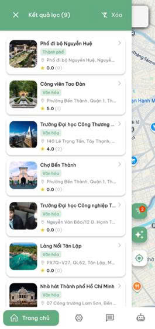
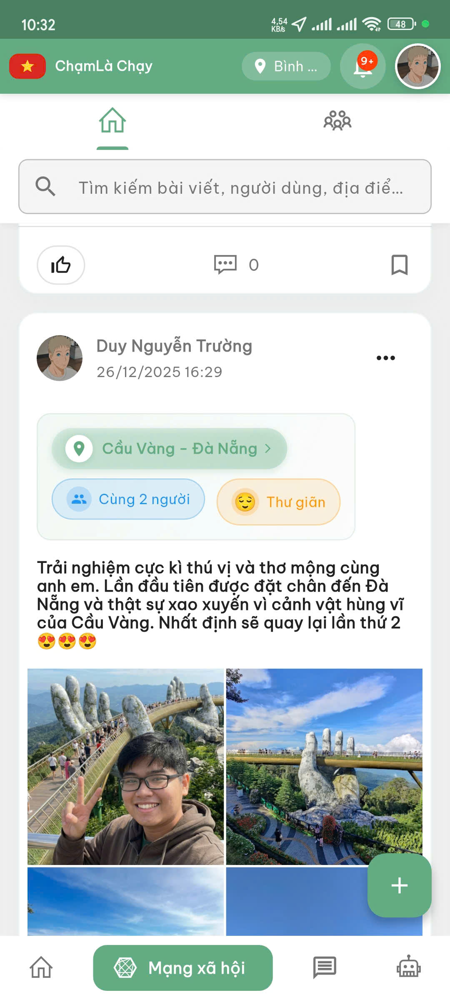
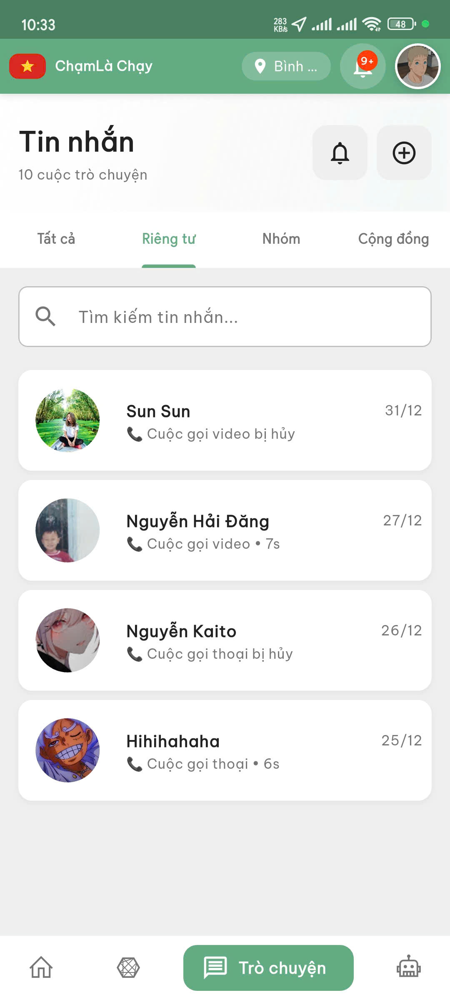
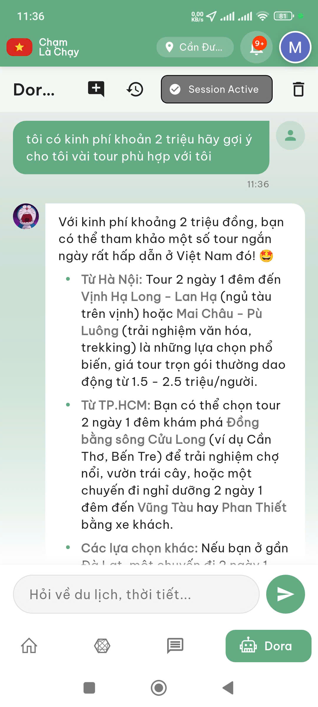
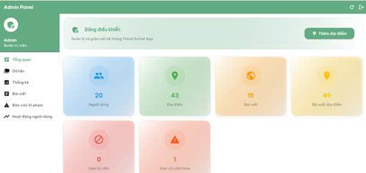
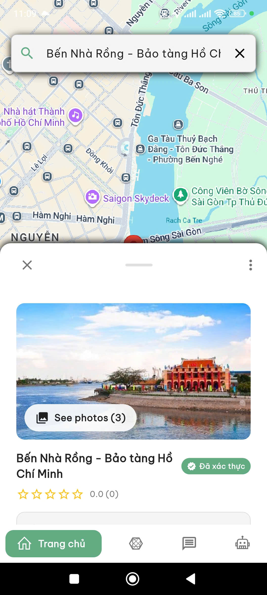

# 🌍 Travel Social App - Complete Documentation

> Ứng dụng mạng xã hội du lịch với AI, xây dựng bằng Flutter & Firebase

## 📑 Mục Lục

- [Tổng Quan](#tổng-quan)
- [Công Nghệ Sử Dụng](#công-nghệ-sử-dụng)
- [Cấu Trúc Dự Án](#cấu-trúc-dự-án)
- [Tính Năng Chi Tiết](#tính-năng-chi-tiết)
- [Cài Đặt & Cấu Hình](#cài-đặt--cấu-hình)
- [Chạy Ứng Dụng](#chạy-ứng-dụng)
- [Database Schema](#database-schema)
- [API Keys & Credentials](#api-keys--credentials)
- [Troubleshooting](#troubleshooting)

---

## 🎯 Tổng Quan
**Hình ảnh**
| Home Page | Post Screen | Chat Screen |
|-----------|-----------|-------------|
|  |  |  |

| AI Assistant | Admin View | Place Screen |
|-----------|-----------|-------------|
|  |  |  |


**Travel Social App** là một nền tảng mạng xã hội chuyên về du lịch, kết hợp các tính năng:
- 🗺️ Tìm kiếm & khám phá địa điểm du lịch
- 📱 Mạng xã hội (posts, comments, reactions)
- 💬 Chat & 📞 Gọi thoại/video
- 🤖 AI Travel Assistant (Gemini 2.0)
- 🎮 Hệ thống gamification (điểm, huy hiệu, xếp hạng)
- 👥 Cộng đồng & nhóm du lịch
- ⚖️ Hệ thống vi phạm & admin quản trị

**Trạng thái:** ✅ 8/8 Core Features Complete

---

## 💻 Công Nghệ Sử Dụng

### Frontend
- **Framework:** Flutter 3.7.2 (Dart SDK)
- **State Management:** Provider
- **UI Libraries:**
  - `google_fonts` - Typography
  - `fl_chart` - Charts & Analytics
  - `cached_network_image` - Image caching
  - `video_player` - Video playback
  - `flutter_markdown` - Markdown rendering

### Backend & Services
- **BaaS:** Firebase (Backend as a Service)
  - Authentication (Email/Password, Google, Facebook)
  - Cloud Firestore (NoSQL Database)
  - Cloud Storage (Media files)
  - Cloud Functions (Serverless backend)
  - Cloud Messaging (Push notifications)

### APIs & Integrations
- **Google Maps API** - Maps, places, directions
- **Google Places API** - Place search & details
- **Google Gemini AI** - AI chatbot assistant
- **OpenWeather API** - Weather information
- **Agora RTC** - Voice & Video calls

### Key Packages
```yaml
firebase_core: ^4.2.0
firebase_auth: ^6.1.1
cloud_firestore: ^6.0.3
cloud_functions: ^6.0.4
firebase_storage: 13.0.3
firebase_messaging: ^16.0.4

google_sign_in: ^6.3.0
flutter_facebook_auth: ^6.0.4
google_maps_flutter: ^2.10.0
agora_rtc_engine: ^6.3.2

provider: ^6.1.5+1
http: ^1.2.2
flutter_dotenv: ^6.0.0
```

---

## 📁 Cấu Trúc Dự Án

```
travel_social_app/
│
├── lib/
│   ├── main.dart                    # Entry point
│   ├── firebase_options.dart        # Firebase config
│   │
│   ├── config/                      # Cấu hình
│   │   └── call_config.dart         # Agora App ID
│   │
│   ├── models/                      # Data Models
│   │   ├── user_model.dart          # User
│   │   ├── post.dart                # Bài viết
│   │   ├── place.dart               # Địa điểm
│   │   ├── review.dart              # Đánh giá
│   │   ├── message.dart             # Tin nhắn
│   │   ├── chat.dart                # Chat/Conversation
│   │   ├── call.dart                # Cuộc gọi
│   │   ├── notification.dart        # Thông báo
│   │   ├── community.dart           # Cộng đồng
│   │   ├── user_badge.dart          # Huy hiệu
│   │   ├── violation_request.dart   # Vi phạm
│   │   └── ... (20+ models)
│   │
│   ├── services/                    # Business Logic
│   │   ├── auth_service.dart        # Xác thực
│   │   ├── user_service.dart        # User CRUD
│   │   ├── post_service.dart        # Bài viết
│   │   ├── place_service.dart       # Địa điểm
│   │   ├── review_service.dart      # Đánh giá
│   │   ├── chat_service.dart        # Chat
│   │   ├── call_service.dart        # Cuộc gọi
│   │   ├── notification_service.dart # Thông báo
│   │   ├── ai_assistant_service.dart # AI chatbot
│   │   ├── recommendation_service.dart # Gợi ý thông minh
│   │   ├── points_tracking_service.dart # Điểm số
│   │   ├── community_service.dart   # Cộng đồng
│   │   ├── violation_request_service.dart # Vi phạm
│   │   └── ... (25+ services)
│   │
│   ├── states/                      # State Management (Provider)
│   │   ├── auth_provider.dart       # Auth state
│   │   ├── post_provider.dart       # Post state
│   │   ├── call_provider.dart       # Call state
│   │   ├── theme_provider.dart      # Theme state
│   │   └── connectivity_provider.dart # Network state
│   │
│   ├── ui/                          # UI Screens
│   │   ├── auth/                    # Login, Register, Splash
│   │   ├── onboarding/              # Onboarding flow
│   │   ├── tabs/                    # Main app tabs
│   │   │   ├── homepage.dart        # Bottom navigation
│   │   │   ├── place/               # Map & Place screens
│   │   │   ├── social/              # Social feed, groups
│   │   │   └── profile/             # Profile, settings, badges
│   │   ├── call/                    # Call screens
│   │   ├── notifications/           # Notification screens
│   │   ├── friends/                 # Friend management
│   │   ├── admin/                   # Admin dashboard
│   │   ├── violation/               # Violation management
│   │   └── smart_recommendation/    # AI recommendations
│   │
│   ├── widgets/                     # Reusable Widgets
│   │   ├── custom_button.dart
│   │   ├── custom_text_field.dart
│   │   ├── custom_app_bar.dart
│   │   ├── expandable_text.dart
│   │   ├── image_picker_grid.dart
│   │   ├── media_viewer.dart
│   │   ├── reaction_button.dart
│   │   └── violation_report_dialog.dart
│   │
│   └── utils/                       # Utilities & Constants
│       ├── constants.dart           # App constants, colors, themes
│       ├── points_system.dart       # Points calculation
│       └── navigation_helper.dart   # Navigation utilities
│
├── functions/                       # Firebase Cloud Functions
│   ├── index.js                     # Main functions entry
│   ├── .env.local                   # Environment variables (local)
│   └── package.json
│
├── assets/                          # Assets
│   ├── icon/                        # App icons
│   ├── default/                     # Default images
│   ├── audio/                       # Audio files (ringtones)
│   ├── messages/                    # Message templates
│   └── logo/                        # Logos
│
├── android/                         # Android config
├── ios/                             # iOS config
├── web/                             # Web config
├── windows/                         # Windows config
│
├── .env                             # Environment variables (git-ignored)
├── .env.example                     # Env template
├── pubspec.yaml                     # Dependencies
├── firebase.json                    # Firebase config
├── firestore.rules                  # Firestore security rules
├── firestore.indexes.json           # Firestore indexes
├── storage.rules                    # Storage security rules
└── README.md                        # This file
```

---

## ✨ Tính Năng Chi Tiết

### 1. 🔐 Xác Thực & Người Dùng

#### Đăng nhập/Đăng ký
- ✅ Email & Password
- ✅ Google Sign-In
- ✅ Facebook Login (Dành cho tester)
- ✅ Lưu trạng thái đăng nhập
- ✅ Quên mật khẩu

#### Profile Management
- ✅ Avatar upload
- ✅ Thông tin cá nhân (tên, bio, địa chỉ)
- ✅ Sở thích du lịch
- ✅ Điểm số & huy hiệu
- ✅ Xếp hạng cộng đồng

**Files:**
- `lib/ui/auth/` - Login, register, splash screens
- `lib/services/auth_service.dart`
- `lib/services/user_service.dart`
- `lib/models/user_model.dart`

---

### 2. 🗺️ Tìm Kiếm Địa Điểm

#### Google Maps Integration
- ✅ Hiển thị bản đồ với markers
- ✅ Vị trí hiện tại (GPS)
- ✅ Tìm kiếm địa điểm theo tên
- ✅ Filter theo loại du lịch (biển, núi, văn hóa...)
- ✅ Chỉ đường (directions)
- ✅ Street View

#### Place Details
- ✅ Hình ảnh (từ Google + reviews)
- ✅ Thông tin cơ bản (tên, địa chỉ, phone)
- ✅ Rating & số lượng đánh giá
- ✅ Giờ mở cửa
- ✅ Nút check-in
- ✅ Link xem đánh giá

#### Place Management
- ✅ Yêu cầu thêm địa điểm mới
- ✅ Admin duyệt/từ chối
- ✅ Thưởng điểm khi địa điểm được duyệt

**Files:**
- `lib/ui/tabs/place/index.dart` - Main map screen
- `lib/ui/tabs/place/widgets/place_detail_sheet.dart`
- `lib/ui/tabs/place/register_place_screen.dart`
- `lib/services/place_service.dart`
- `lib/services/place_edit_request_service.dart`
- `lib/models/place.dart`

**Docs:** `PLACE_SEARCH_IMPROVEMENTS.md`

---

### 3. ⭐ Đánh Giá Địa Điểm

#### Review Features
- ✅ Viết đánh giá (rating 1-5 sao + nội dung)
- ✅ Upload ảnh (tối đa 5 ảnh)
- ✅ Chỉnh sửa/xóa đánh giá của mình
- ✅ Xem tất cả đánh giá của địa điểm
- ✅ Xem tất cả ảnh từ reviews
- ✅ Zoom ảnh full screen
- ✅ Tự động cập nhật rating địa điểm

**UI Components:**
- Write Review Screen (rating slider, text input, image picker)
- Reviews List Screen (realtime stream)
- All Images Grid Screen
- Place Detail Sheet (image layout)

**Files:**
- `lib/ui/tabs/place/write_review_screen.dart`
- `lib/ui/tabs/place/reviews_screen.dart`
- `lib/services/review_service.dart`
- `lib/models/review.dart`

**Docs:** `REVIEWS_SYSTEM_DOCUMENTATION.md`

---

### 4. 📱 Mạng Xã Hội

#### Posts & Feed
- ✅ Tạo bài viết (text, images, videos)
- ✅ Tag địa điểm vào bài viết
- ✅ Edit/Delete bài viết
- ✅ Reactions (Like, Love, Haha, Wow, Sad, Angry)
- ✅ Comment
- ✅ Share
- ✅ Lưu bài viết
- ✅ Tìm kiếm bài viết

#### Groups & Communities
- ✅ Tạo cộng đồng du lịch
- ✅ Admin quản lý thành viên
- ✅ Yêu cầu tham gia & duyệt
- ✅ Đăng bài trong nhóm (private)
- ✅ Admin xóa bài vi phạm

**Tab Navigation:**
- **Trang chủ:** Posts công khai
- **Cộng đồng:** Danh sách groups

**Files:**
- `lib/ui/tabs/social/social_home_screen.dart`
- `lib/ui/tabs/social/post/` - Post screens
- `lib/ui/tabs/social/group/` - Group screens
- `lib/ui/tabs/social/widgets/post_item.dart`
- `lib/services/post_service.dart`
- `lib/services/community_service.dart`
- `lib/services/reaction_service.dart`
- `lib/models/post.dart`
- `lib/models/community.dart`


---

### 5. 💬 Chat & 📞 Calls

#### Chat System
- ✅ Private chat (1-1)
- ✅ Group chat (admin management)
- ✅ Community chat (public)
- ✅ Gửi text, ảnh
- ✅ Reply message
- ✅ Đánh dấu đã đọc
- ✅ Số tin nhắn chưa đọc (badge)
- ✅ Edit/Delete message

#### Voice & Video Calls
- ✅ Gọi thoại 1-1 và group (<4 người)
- ✅ Gọi video 1-1 và group (<4 người)
- ✅ Incoming call screen (full overlay)
- ✅ Call controls (mute, speaker, camera)
- ✅ Duration timer
- ✅ Wake lock (giữ màn hình sáng)
- ✅ Agora RTC Engine integration

**Call Flow:**
```
User A → Click call → CallService → Firestore
    ↓
User B → Listen → Incoming call overlay
    ↓
Answer → Both join Agora channel → Stream video/audio
```

**Files:**
- `lib/ui/tabs/message/` - Chat screens
- `lib/ui/call/` - Call screens
- `lib/services/chat_service.dart`
- `lib/services/call_service.dart`
- `lib/states/call_provider.dart`
- `lib/models/chat.dart`
- `lib/models/call.dart`
- `lib/models/message.dart`

**Docs:**
- `CHAT_SYSTEM.md`
- `CALL_SYSTEM_COMPLETE.md`
- `MESSAGE_EDIT_DELETE_COMPLETE.md`

---

### 6. 🤖 AI Travel Assistant

#### Gemini 2.0 Integration
- ✅ Chat với AI về du lịch
- ✅ Gợi ý địa điểm
- ✅ Thông tin thời tiết (OpenWeather API)
- ✅ Session management
- ✅ Lưu lịch sử chat (20 messages gần nhất)
- ✅ Context-aware responses

#### Features
- Hỏi về địa điểm du lịch
- Gợi ý lịch trình
- Thông tin văn hóa, ẩm thực
- Thời tiết real-time
- Tips & tricks du lịch

**Architecture:**
```
Flutter App → Firebase Functions → Gemini API
                                 ↓
                          OpenWeather API
```

**Files:**
- `lib/ui/tabs/ai_assistant/` - Chat UI
- `lib/services/ai_assistant_service.dart`
- `lib/services/ai_context_service.dart`
- `functions/index.js` - Cloud Functions

**Cloud Function:** `generateAIResponse`

**Docs:**
- `AI_ASSISTANT_README.md`
- `AI_ASSISTANT_SETUP.md`
- `AI_CONTEXT_SYSTEM.md`

---

### 7. 🎮 Gamification System

#### Points & Badges
- ✅ 10 cấp huy hiệu (Người mới → Thần thoại)
- ✅ Tích điểm qua hoạt động
- ✅ Xếp hạng toàn cầu
- ✅ Leaderboard
- ✅ Badge progression UI
- ✅ Activity history

#### Cách Kiếm Điểm

| Hoạt động | Điểm |
|-----------|------|
| Place request được duyệt | 1,000 |
| Review địa điểm | 100-200 |
| Tạo post | 100-150 |
| Comment | 10 |
| Like | 5 |
| Đăng nhập hàng ngày | 10 |
| Streak 7 ngày | 100 |
| Streak 30 ngày | 500 |

#### Huy Hiệu

| Level | Tên | Điểm Yêu Cầu | Icon |
|-------|-----|--------------|------|
| 1 | Người mới | 0 | 🌱 |
| 2 | Nhà khám phá | 500 | 🧭 |
| 3 | Du khách | 1,000 | 🎒 |
| 4 | Phiêu lưu gia | 2,500 | ⛰️ |
| 5 | Hướng dẫn viên | 5,000 | 🗺️ |
| 6 | Chuyên gia | 10,000 | 🎓 |
| 7 | Bậc thầy | 20,000 | 👑 |
| 8 | Huyền thoại | 50,000 | 🏆 |
| 9 | Đại tông sư | 100,000 | ⭐ |
| 10 | Thần thoại | 200,000 | 💎 |

**Files:**
- `lib/ui/tabs/profile/badge_screen.dart` - Badge UI
- `lib/services/points_tracking_service.dart`
- `lib/models/user_badge.dart`
- `lib/utils/points_system.dart`

---

### 8. 🔔 Thông Báo

#### Push Notifications (FCM)
- ✅ Friend request
- ✅ Friend accept
- ✅ Post like/comment
- ✅ Review like
- ✅ Message received
- ✅ Badge với số chưa đọc
- ✅ Foreground/Background/Terminated handling

#### In-App Notifications
- ✅ Notification center
- ✅ Mark as read
- ✅ Swipe to delete
- ✅ Navigate to related content
- ✅ Real-time updates

**Files:**
- `lib/ui/notifications/notifications_screen.dart`
- `lib/services/notification_service.dart`
- `lib/models/notification.dart`
- `lib/widgets/custom_app_bar.dart` - Badge

**Docs:** `NOTIFICATION_SYSTEM.md`

---

### 9. 🎯 Smart Recommendations

#### AI-Powered Place Suggestions
- ✅ Dựa trên vị trí hiện tại (GPS)
- ✅ Phân tích hành vi người dùng
- ✅ Sở thích cá nhân
- ✅ 3 tabs: Thông minh, Gần bạn, Sở thích

#### Scoring Algorithm
```dart
Total Score = Distance (30) + Preference (40) + Rating (20) + Reviews (10)
```

**Factors:**
- Khoảng cách từ vị trí hiện tại
- Loại địa điểm yêu thích (từ lịch sử)
- Rating của địa điểm
- Số lượng reviews

**Files:**
- `lib/ui/tabs/place/smart_recommendations_screen.dart`
- `lib/services/recommendation_service.dart`

**Docs:** `SMART_RECOMMENDATIONS_GUIDE.md`

---

### 10. ⚖️ Hệ Thống Vi Phạm

#### Violation Management
- ✅ Báo cáo vi phạm (post, comment, user)
- ✅ Admin panel
- ✅ Review & duyệt vi phạm
- ✅ Gửi email thông báo
- ✅ Xử lý: Xóa nội dung/Ban user
- ✅ Lịch sử vi phạm

#### Loại Vi Phạm
- Nội dung không phù hợp
- Spam
- Bạo lực/Ghét
- Thông tin sai lệch
- Vi phạm bản quyền

**Files:**
- `lib/ui/admin/` - Admin dashboard
- `lib/ui/violation/` - Violation screens
- `lib/services/violation_request_service.dart`
- `lib/services/admin_service.dart`
- `lib/models/violation_request.dart`
- `lib/widgets/violation_report_dialog.dart`

**Docs:**
- `VIOLATION_SYSTEM_SUMMARY.md`
- `VIOLATION_INTEGRATION_COMPLETE.md`
- `ADMIN_SETUP.md`

---

### 11. 👥 Friend Management

#### Features
- ✅ Gửi lời mời kết bạn
- ✅ Chấp nhận/Từ chối
- ✅ Danh sách bạn bè
- ✅ Unfriend
- ✅ Xem profile bạn bè
- ✅ Notification khi có lời mời

**Files:**
- `lib/ui/friends/` - Friend screens
- `lib/services/friend_service.dart`
- `lib/models/friend.dart`

---

### 12. 🌓 Dark Mode & Theme

#### Features
- ✅ Light theme
- ✅ Dark theme
- ✅ Auto (follow system)
- ✅ Persistent settings
- ✅ Smooth transition

**Colors:**
- Primary: `#63AB83` (Green)
- Light background: `#F5F5F5`
- Dark background: `#121212`

**Files:**
- `lib/states/theme_provider.dart`
- `lib/utils/constants.dart` - Themes

**Docs:** `THEME_PROVIDER_IMPLEMENTATION.md`

---

### 13. 📊 Activity Tracking

#### Analytics
- ✅ Track user actions
- ✅ Points earned per action
- ✅ Activity history
- ✅ Today's points
- ✅ Streak tracking

**Files:**
- `lib/services/activity_tracking_service.dart`

**Docs:** `ACTIVITY_TRACKING_GUIDE.md`, `BEHAVIORAL_ACTIVITY_TRACKING.md`

---

### 14. 📍 Check-in

#### Features
- ✅ Check-in tại địa điểm
- ✅ Thưởng điểm
- ✅ Hiển thị trên profile
- ✅ Lịch sử check-in

**Files:**
- `lib/ui/tabs/place/checkin_dialog.dart`
- `lib/services/checkin_service.dart`

---

### 15. 🔌 Connectivity Check

#### Features
- ✅ Kiểm tra kết nối internet
- ✅ Hiển thị màn hình lỗi khi offline
- ✅ Retry button
- ✅ Real-time connection status

**Files:**
- `lib/ui/error/no_internet_screen.dart`
- `lib/states/connectivity_provider.dart`
- `lib/services/connectivity_service.dart`

---

## 🛠️ Cài Đặt & Cấu Hình

### Prerequisites

1. **Flutter SDK** (3.7.2+)
   ```powershell
   flutter --version
   ```

2. **Android Studio** (cho Android build)
3. **Xcode** (cho iOS build - macOS only)
4. **Firebase CLI**
   ```powershell
   npm install -g firebase-tools
   firebase --version
   ```

5. **Node.js** (20+) - Cho Cloud Functions
   ```powershell
   node --version
   ```

---

### Bước 1: Clone Repository

```powershell
git clone <repository-url>
cd travel_social_app
```

---

### Bước 2: Cài Đặt Dependencies

#### Flutter Dependencies
```powershell
flutter pub get
```

#### Firebase Functions Dependencies
```powershell
cd functions
npm install
cd ..
```

---

### Bước 3: Cấu Hình Firebase

#### A. Tạo Firebase Project
1. Vào https://console.firebase.google.com
2. Tạo project mới hoặc sử dụng project hiện tại
3. Thêm app (Android/iOS/Web)

#### B. Download Config Files

**Android:**
- Download `google-services.json`
- Copy vào `android/app/`

**iOS:**
- Download `GoogleService-Info.plist`
- Copy vào `ios/Runner/`

**Web:**
- Copy Firebase config vào `lib/firebase_options.dart`

#### C. Update Firebase Options
File `lib/firebase_options.dart` đã có sẵn, cập nhật với thông tin của project:

```dart
static const FirebaseOptions android = FirebaseOptions(
  apiKey: 'YOUR_ANDROID_API_KEY',
  appId: 'YOUR_ANDROID_APP_ID',
  messagingSenderId: 'YOUR_SENDER_ID',
  projectId: 'YOUR_PROJECT_ID',
  storageBucket: 'YOUR_BUCKET.firebasestorage.app',
);
```

---

### Bước 4: API Keys Configuration

#### A. Tạo File `.env`
Copy từ template:
```powershell
Copy-Item .env.example .env
```

#### B. Điền API Keys vào `.env`

```env
# Google Maps & Places
GOOGLE_MAPS_API_KEY=YOUR_GOOGLE_MAPS_KEY
GOOGLE_PLACES_API_KEY=YOUR_GOOGLE_PLACES_KEY

# Google Gemini AI
GEMINI_API_KEY=YOUR_GEMINI_API_KEY

# Agora (Voice/Video Calls)
AGORA_APP_ID=YOUR_AGORA_APP_ID

# Firebase (for Functions)
FIREBASE_PROJECT_ID=your_project_id
```

#### C. Lấy API Keys

**1. Google Maps API:**
- Vào https://console.cloud.google.com
- Enable APIs:
  - Maps SDK for Android/iOS
  - Places API
  - Directions API
  - Geocoding API
- Tạo API key trong "Credentials"

**2. Google Gemini AI:**
- Vào https://ai.google.dev/
- Đăng nhập → Tạo API key
- Copy key

**3. Agora (Calls):**
- Vào https://console.agora.io/
- Đăng ký miễn phí
- Tạo project mới
- Copy App ID
- **Free tier:** 10,000 phút/tháng

**4. OpenWeather API (Optional - cho AI):**
- Vào https://openweathermap.org/api
- Đăng ký miễn phí
- Copy API key

---

### Bước 5: Cấu Hình Platform-Specific

#### Android (`android/app/src/main/AndroidManifest.xml`)

```xml
<!-- Permissions -->
<uses-permission android:name="android.permission.INTERNET"/>
<uses-permission android:name="android.permission.ACCESS_FINE_LOCATION"/>
<uses-permission android:name="android.permission.ACCESS_COARSE_LOCATION"/>
<uses-permission android:name="android.permission.CAMERA"/>
<uses-permission android:name="android.permission.RECORD_AUDIO"/>
<uses-permission android:name="android.permission.POST_NOTIFICATIONS"/>

<!-- Google Maps API Key -->
<meta-data
    android:name="com.google.android.geo.API_KEY"
    android:value="YOUR_GOOGLE_MAPS_API_KEY"/>
```

#### iOS (`ios/Runner/Info.plist`)

```xml
<key>NSLocationWhenInUseUsageDescription</key>
<string>App cần quyền truy cập vị trí để hiển thị địa điểm gần bạn</string>

<key>NSCameraUsageDescription</key>
<string>App cần quyền camera để chụp ảnh</string>

<key>NSMicrophoneUsageDescription</key>
<string>App cần quyền microphone để gọi thoại</string>

<key>io.flutter.embedded_views_preview</key>
<true/>
```

---

### Bước 6: Deploy Firebase

#### A. Login Firebase CLI
```powershell
firebase login
```

#### B. Set Project
```powershell
firebase use --add
# Chọn project của bạn
```

#### C. Deploy Firestore Rules
```powershell
firebase deploy --only firestore:rules
```

#### D. Deploy Storage Rules
```powershell
firebase deploy --only storage
```

#### E. Deploy Cloud Functions

**Cấu hình Functions:**
1. Tạo file `functions/.env.local`:
   ```env
   GEMINI_API_KEY=your_gemini_key
   OPENWEATHER_API_KEY=your_openweather_key
   ```

2. Deploy:
   ```powershell
   cd functions
   npm install
   cd ..
   firebase deploy --only functions
   ```

**Hoặc dùng script:**
```powershell
.\deploy_firebase.ps1
```

---

### Bước 7: Firestore Indexes

Một số query phức tạp cần indexes. Firebase sẽ tự động suggest hoặc bạn có thể tạo thủ công:

File `firestore.indexes.json` đã có sẵn. Deploy:
```powershell
firebase deploy --only firestore:indexes
```

**Composite Indexes Quan Trọng:**
- `posts`: `communityId` + `createdAt` (DESC)
- `messages`: `chatId` + `sentAt` (DESC)
- `reviews`: `placeId` + `createdAt` (DESC)
- `point_history`: `userId` + `timestamp` (DESC)

---

### Bước 8: Admin Setup

#### Tạo Admin User
1. Đăng ký user bình thường trong app
2. Vào Firebase Console → Firestore
3. Tìm document user
4. Thêm field: `isAdmin: true`

Hoặc dùng Firebase CLI:
```js
// functions/index.js - Thêm function
exports.makeAdmin = functions.https.onCall(async (data, context) => {
  await admin.firestore().collection('users').doc(data.uid).update({
    isAdmin: true
  });
});
```

**Docs:** `ADMIN_SETUP.md`

---

### Bước 9: Authentication Setup

#### Google Sign-In
1. Firebase Console → Authentication → Sign-in method
2. Enable "Google"
3. Copy Web client ID vào `android/app/` và `ios/Runner/`

#### Facebook Login
1. Tạo Facebook App: https://developers.facebook.com
2. Enable Facebook Login
3. Copy App ID và App Secret vào Firebase
4. Enable trong Firebase Authentication

**Docs:** `FACEBOOK_LOGIN_SETUP.md`

---

## 🚀 Chạy Ứng Dụng

### Development Mode

#### 1. Run trên Android Emulator
```powershell
flutter run
```

#### 2. Run trên iOS Simulator (macOS)
```powershell
flutter run -d ios
```

#### 3. Run trên Web
```powershell
flutter run -d chrome
```

#### 4. Run trên Windows
```powershell
flutter run -d windows
```

---

### Debug Mode

```powershell
flutter run --debug
```

Hoặc dùng VS Code:
- Press F5
- Chọn device từ status bar

---

### Release Build

#### Android APK
```powershell
flutter build apk --release
# Output: build/app/outputs/flutter-apk/app-release.apk
```

#### Android App Bundle (cho Play Store)
```powershell
flutter build appbundle --release
# Output: build/app/outputs/bundle/release/app-release.aab
```

#### iOS (macOS only)
```powershell
flutter build ios --release
# Sau đó mở Xcode để archive
```

#### Web
```powershell
flutter build web --release
# Output: build/web/
```

---

### Clean Build (nếu có lỗi)

```powershell
flutter clean
flutter pub get
flutter run
```

---

## 🗄️ Database Schema

### Firestore Collections

#### 1. `users`
```json
{
  "userId": "auto-generated",
  "fullName": "Nguyễn Văn A",
  "email": "user@example.com",
  "avatar": "https://...",
  "bio": "Travel lover",
  "address": "Hà Nội",
  "phone": "0123456789",
  "totalPoints": 1250,
  "level": 3,
  "currentBadge": {
    "name": "Du khách",
    "icon": "🎒",
    "level": 3
  },
  "favoriteTypes": ["type1", "type2"],
  "fcmToken": "device-token",
  "isAdmin": false,
  "isBanned": false,
  "createdAt": Timestamp,
  "updatedAt": Timestamp
}
```

#### 2. `places`
```json
{
  "placeId": "auto-generated",
  "name": "Hồ Hoàn Kiếm",
  "description": "...",
  "address": "Hà Nội",
  "location": GeoPoint(21.0285, 105.8542),
  "typeId": "tourism-type-id",
  "rating": 4.5,
  "reviewCount": 120,
  "images": ["url1", "url2"],
  "googlePlaceId": "ChIJ...",
  "isApproved": true,
  "createdBy": "userId",
  "createdAt": Timestamp
}
```

#### 3. `posts`
```json
{
  "postId": "auto-generated",
  "userId": "user-id",
  "content": "Beautiful place!",
  "mediaUrls": ["url1", "url2"],
  "taggedPlaceId": "place-id",
  "communityId": "community-id" | null,
  "likeCount": 50,
  "commentCount": 10,
  "shareCount": 5,
  "createdAt": Timestamp
}
```

#### 4. `reviews`
```json
{
  "reviewId": "auto-generated",
  "userId": "user-id",
  "placeId": "place-id",
  "rating": 4.0,
  "content": "Great experience!",
  "images": ["url1", "url2"],
  "createdAt": Timestamp
}
```

#### 5. `chats`
```json
{
  "chatId": "auto-generated",
  "chatType": "Riêng tư" | "Group chat" | "Cộng đồng",
  "members": ["userId1", "userId2"],
  "groupAdmin": "userId" | null,
  "lastMessage": "Hello!",
  "lastMessageTime": Timestamp,
  "lastMessageSenderId": "userId",
  "createdAt": Timestamp
}
```

#### 6. `messages`
```json
{
  "messageId": "auto-generated",
  "chatId": "chat-id",
  "senderId": "user-id",
  "message": "Hello!",
  "imageUrl": "url" | null,
  "replyToMessageId": "message-id" | null,
  "isRead": false,
  "sentAt": Timestamp
}
```

#### 7. `calls`
```json
{
  "callId": "auto-generated",
  "callerId": "user-id",
  "receiverIds": ["userId1", "userId2"],
  "callType": "voice" | "video",
  "callStatus": "ringing" | "answered" | "ended" | "missed" | "rejected",
  "channelName": "agora-channel-name",
  "createdAt": Timestamp,
  "answeredAt": Timestamp | null,
  "endedAt": Timestamp | null
}
```

#### 8. `notifications`
```json
{
  "notificationId": "auto-generated",
  "userId": "user-id",
  "type": "friend_request" | "post_like" | "message" | ...,
  "title": "Notification title",
  "body": "Notification body",
  "imageUrl": "url" | null,
  "data": {
    "senderId": "user-id",
    "postId": "post-id"
  },
  "isRead": false,
  "createdAt": Timestamp
}
```

#### 9. `communities`
```json
{
  "communityId": "auto-generated",
  "name": "Du lịch Đà Lạt",
  "description": "...",
  "adminId": "user-id",
  "memberIds": ["userId1", "userId2"],
  "pendingRequests": ["userId3"],
  "tourismTypes": ["typeId1", "typeId2"],
  "avatarUrl": "url",
  "memberCount": 150,
  "postCount": 320,
  "createdAt": Timestamp
}
```

#### 10. `point_history`
```json
{
  "historyId": "auto-generated",
  "userId": "user-id",
  "action": "reviewPlace" | "createPost" | "dailyLogin" | ...,
  "points": 100,
  "description": "Viết đánh giá địa điểm",
  "timestamp": Timestamp,
  "metadata": {
    "placeId": "place-id",
    "reviewId": "review-id"
  }
}
```

#### 11. `violation_requests`
```json
{
  "requestId": "auto-generated",
  "reporterId": "user-id",
  "violationType": "post" | "comment" | "user",
  "targetId": "target-id",
  "reason": "Nội dung không phù hợp",
  "description": "...",
  "mediaUrls": ["url1"],
  "status": "pending" | "approved" | "rejected",
  "adminNotes": "...",
  "reviewedBy": "admin-id" | null,
  "reviewedAt": Timestamp | null,
  "createdAt": Timestamp
}
```

#### 12. `friendships`
```json
{
  "friendshipId": "auto-generated",
  "senderId": "user-id",
  "receiverId": "user-id",
  "status": "pending" | "accepted" | "rejected",
  "createdAt": Timestamp,
  "updatedAt": Timestamp
}
```

#### 13. `reactions`
```json
{
  "reactionId": "auto-generated",
  "postId": "post-id",
  "userId": "user-id",
  "reactionType": "like" | "love" | "haha" | "wow" | "sad" | "angry",
  "createdAt": Timestamp
}
```

#### 14. `comments`
```json
{
  "commentId": "auto-generated",
  "postId": "post-id",
  "userId": "user-id",
  "content": "Nice post!",
  "likeCount": 5,
  "createdAt": Timestamp
}
```

#### 15. `ai_sessions`
```json
{
  "sessionId": "auto-generated",
  "userId": "user-id",
  "messages": [
    {
      "role": "user" | "assistant",
      "content": "...",
      "timestamp": Timestamp
    }
  ],
  "createdAt": Timestamp,
  "updatedAt": Timestamp
}
```

---

## 🔑 API Keys & Credentials

### Danh Sách API Cần Thiết

| API | Mục Đích | Free Tier | Link |
|-----|----------|-----------|------|
| Google Maps | Bản đồ, directions | $200/tháng | [Console](https://console.cloud.google.com) |
| Google Places | Tìm kiếm địa điểm | $200/tháng | [Console](https://console.cloud.google.com) |
| Google Gemini | AI chatbot | Free | [AI Studio](https://ai.google.dev) |
| Agora | Voice/Video calls | 10,000 phút/tháng | [Console](https://console.agora.io) |
| OpenWeather | Thời tiết | 1,000 calls/ngày | [API](https://openweathermap.org/api) |
| Firebase | Backend services | Spark plan (free) | [Console](https://console.firebase.google.com) |

### File Cấu Hình

#### `.env` (Root level)
```env
GOOGLE_MAPS_API_KEY=AIzaSy...
GOOGLE_PLACES_API_KEY=AIzaSy...
GEMINI_API_KEY=AIzaSy...
AGORA_APP_ID=abc123...
```

#### `functions/.env.local` (Cloud Functions)
```env
GEMINI_API_KEY=AIzaSy...
OPENWEATHER_API_KEY=abc123...
```

#### `lib/config/call_config.dart` (Agora)
```dart
class CallConfig {
  static const String agoraAppId = 'YOUR_AGORA_APP_ID';
}
```

---

## 🐛 Troubleshooting

### 1. Build Errors

#### "google-services.json not found"
```powershell
# Download từ Firebase Console
# Copy vào android/app/
```

#### "CocoaPods error" (iOS)
```powershell
cd ios
pod install
cd ..
flutter run
```

#### "Dependency conflict"
```powershell
flutter clean
flutter pub get
```

---

### 2. Firebase Errors

#### "FirebaseException: Missing or insufficient permissions"
- Kiểm tra Firestore Rules
- Deploy rules: `firebase deploy --only firestore:rules`

#### "Function not found"
- Deploy functions: `firebase deploy --only functions`
- Kiểm tra function name trong code

#### "Storage permission denied"
- Deploy storage rules: `firebase deploy --only storage`

---

### 3. Google Maps Errors

#### "Map not showing"
- Kiểm tra API key trong `AndroidManifest.xml`
- Enable Maps SDK trong Google Cloud Console
- Check billing enabled

#### "Places not loading"
- Enable Places API
- Check API key restrictions
- Verify quotas

---

### 4. Call System Errors

#### "Agora not initialized"
- Check Agora App ID trong `.env`
- Verify `lib/config/call_config.dart`

#### "Camera/Microphone permission denied"
- Grant permissions trong Settings
- Check `AndroidManifest.xml` và `Info.plist`

#### "Incoming call not showing"
- Check `CallProvider` trong `main.dart`
- Verify `listenToIncomingCalls()` được gọi

---

### 5. AI Assistant Errors

#### "Function generateAIResponse failed"
- Check Gemini API key trong `functions/.env.local`
- Deploy functions: `firebase deploy --only functions`
- View logs: `firebase functions:log`

#### "Weather data not loading"
- Check OpenWeather API key
- Verify API key active

---

### 6. Notification Errors

#### "FCM token null"
- Check Firebase Messaging initialized
- Verify permissions granted
- See `lib/main.dart` - FCM setup

#### "Notifications not received"
- Check FCM token saved in Firestore
- Verify notification payload
- Test with Firebase Console → Cloud Messaging

---

### 7. Performance Issues

#### "App slow/laggy"
```powershell
# Run in release mode
flutter run --release

# Profile mode
flutter run --profile
```

#### "Images loading slowly"
- Check network connection
- Images auto-cached with `cached_network_image`
- Reduce image quality in upload

---

## 📚 Documentation Files

### Setup Guides
- `ADMIN_SETUP.md` - Admin user setup
- `AI_ASSISTANT_SETUP.md` - AI chatbot setup
- `CALL_SYSTEM_SETUP.md` - Agora calls setup
- `FACEBOOK_LOGIN_SETUP.md` - Facebook auth
- `SETUP_CORS.md` - CORS for Firebase Storage

### Feature Documentation
- `GAMIFICATION_SYSTEM.md` - Points & badges
- `CHAT_SYSTEM.md` - Chat system
- `CALL_SYSTEM_COMPLETE.md` - Voice/video calls
- `GROUP_COMMUNITY_SYSTEM.md` - Communities
- `REVIEWS_SYSTEM_DOCUMENTATION.md` - Reviews
- `NOTIFICATION_SYSTEM.md` - Push notifications
- `SMART_RECOMMENDATIONS_GUIDE.md` - AI recommendations
- `REACTIONS_SYSTEM_DOCUMENTATION.md` - Post reactions
- `VIOLATION_SYSTEM_SUMMARY.md` - Violation management

### Technical Docs
- `DATABASE_SCHEMA_COMPLETE.md` - Firestore schema
- `AI_FIRESTORE_RULES.md` - Security rules
- `FIRESTORE_INDEX_GUIDE.md` - Indexes
- `STORAGE_RULES_GUIDE.md` - Storage rules
- `THEME_PROVIDER_IMPLEMENTATION.md` - Dark mode

### Testing & Deployment
- `TEST_GUIDE.md` - Testing guide
- `AI_DEPLOYMENT_CHECKLIST.md` - Deployment checklist
- `FINAL_REPORT_CHECKLIST.md` - Feature checklist

---

## 🎬 Demo & Testing

### Test Accounts (Local Development)

Tạo test users trong Authentication:

```
User 1:
- Email: user1@test.com
- Password: test1234

User 2:
- Email: user2@test.com
- Password: test1234

Admin:
- Email: admin@test.com
- Password: admin1234
- isAdmin: true (set in Firestore)
```

### Test Scenarios

#### 1. User Flow
1. Đăng ký user mới
2. Onboarding (chọn sở thích)
3. Cấp quyền GPS, Camera, Mic
4. Xem bản đồ địa điểm
5. Viết review địa điểm
6. Tạo bài viết
7. Tham gia cộng đồng
8. Chat với user khác
9. Gọi voice/video
10. Kiểm tra điểm & huy hiệu

#### 2. Admin Flow
1. Login với admin account
2. Vào Admin Dashboard
3. Duyệt violation requests
4. Ban user vi phạm
5. Duyệt place requests

#### 3. Social Flow
1. Login 2 users khác nhau
2. User A: Gửi lời mời kết bạn → User B
3. User B: Nhận notification → Chấp nhận
4. User A: Tạo bài viết
5. User B: Like, comment
6. User A: Nhận notification

#### 4. AI Assistant
1. Vào tab AI Assistant
2. Hỏi: "Thời tiết Hà Nội hôm nay?"
3. Hỏi: "Gợi ý địa điểm du lịch Đà Nẵng"
4. Kiểm tra lịch sử chat

---

## 📊 Project Statistics

- **Total Lines of Code:** ~50,000+
- **Total Files:** 150+
- **Models:** 20+
- **Services:** 25+
- **UI Screens:** 80+
- **Widgets:** 30+
- **Firebase Collections:** 15+
- **Cloud Functions:** 5+

---

## 🚀 Deployment to Production

### 1. Prepare for Production

#### Update Config
- Thay API keys production
- Enable App Certificate trong Agora
- Setup token generation server cho Agora
- Enable Firebase App Check

#### Build Optimization
```powershell
# Optimize assets
flutter pub run flutter_launcher_icons:main

# Build release
flutter build apk --release --split-per-abi
```

---

### 2. Deploy Firebase

```powershell
# Deploy all
firebase deploy

# Deploy specific
firebase deploy --only firestore,functions,storage
```

---

### 3. Publish to Stores

#### Google Play Store
1. Build app bundle: `flutter build appbundle`
2. Upload to Play Console
3. Fill metadata (screenshots, description)
4. Submit for review

#### Apple App Store
1. Build iOS: `flutter build ios`
2. Open Xcode → Archive
3. Upload to App Store Connect
4. Submit for review

---

## 🔒 Security Best Practices

### 1. API Keys
- ✅ Không commit `.env` vào Git
- ✅ Use environment variables
- ✅ Restrict API keys by app (Bundle ID)
- ✅ Enable billing alerts

### 2. Firestore Rules
- ✅ Validate user authentication
- ✅ Check ownership before write/delete
- ✅ Validate data types
- ✅ Rate limiting

### 3. Storage Rules
- ✅ Restrict file types
- ✅ Limit file size (max 10MB)
- ✅ Validate owner

### 4. Functions
- ✅ Validate input data
- ✅ Rate limiting
- ✅ Error handling
- ✅ Logging

---

## 🤝 Contributing

### Branch Strategy
- `main` - Production
- `develop` - Development
- `feature/*` - New features
- `bugfix/*` - Bug fixes

### Commit Convention
```
feat: Add new feature
fix: Fix bug
docs: Update documentation
style: Format code
refactor: Refactor code
test: Add tests
```

---

## 📝 License

[Add your license here]

---

## 👨‍💻 Authors

- **Your Name** - Initial work

---

## 🙏 Acknowledgments

- Flutter team
- Firebase team
- Google Maps Platform
- Agora.io
- OpenAI Community

---

## 📞 Support

- **Email:** your.email@example.com
- **GitHub Issues:** [Link to issues]
- **Documentation:** See `/docs` folder

---

## 🗓️ Version History

### v1.0.0 (Current)
- ✅ All 8 core features complete
- ✅ Admin panel
- ✅ Violation system
- ✅ Gamification
- ✅ AI Assistant
- ✅ Voice/Video calls
- ✅ Smart recommendations

---

## 🎯 Roadmap (Future Features)

### Phase 2
- [ ] Trip planner with itinerary
- [ ] Offline mode with local database
- [ ] AR navigation
- [ ] Travel booking integration
- [ ] Multi-language support
- [ ] Social login (Apple, Twitter)

### Phase 3
- [ ] ML-based recommendation engine
- [ ] Live streaming
- [ ] Events & meetups
- [ ] Travel insurance integration
- [ ] Rewards & vouchers system

---

**Last Updated:** December 2, 2025  
**Version:** 1.0.0  
**Status:** ✅ Production Ready

---

Made with ❤️ using Flutter & Firebase
